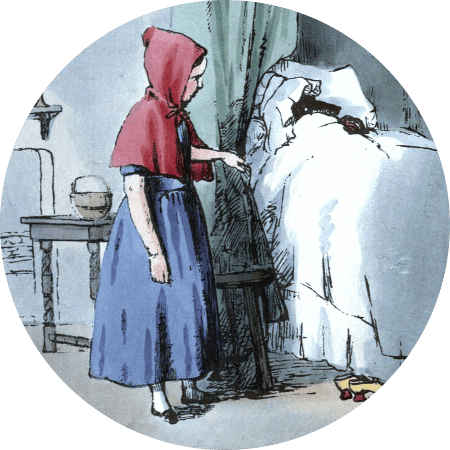

## Introduction

In this post I'm going to tell you about some of the skills that are vital for good academic essay writing: why they matter, how to develop them for yourself and how to avoid common mistakes. My focus is on these skills rather than the essay-writing process. I don't tell you step-by-step what to do when you are writing, because this will change depending on your study habits and the essay itself. Instead, I've tried to cover areas of academic writing that can be challenging or unfamiliar but that are important to writing well.

Most of the advice here applies to academic writing in any field, but a few things will be more specific to the humanities or to my own subjects. For example - some courses in the social sciences advise students not to write in the first person (don't use the word 'I'). This is in order to ensure they rely on published research and recognised authorities in their writing. This isn't true in my fields of philosophy and theology, where directly expressing your own opinion (and backing it up with argument and evidence) is a really important part of showing independence of thought.

So if you're a student using this guide, and something I say seems to conflict with guidance from your course - follow that guidance!

---

## Understanding the question

Reading the question incorrectly is genuinely one of the most common mistakes students make, and it's a mistake that can really derail what would otherwise be a good essay. It happens because academic essay questions are often *highly* specific, and require you to do or show several different things. Interpreting them is a skill in itself. So it is worth taking the time to be sure you understand what you are being asked! As well as telling you what you should write, a careful reading of the question will also tell you what you should leave out.

Pay close attention to the exact wording. Small changes can be enough to make very big differences to what you need to write.

Questions often leave some room for interpretation, and there can be very different (but equally good) ways of answering the same question. When you are deciding which approach to take, try to pick a focus that interests you and that allows you to say something you think is important. You should also ask yourself what the context of the module is and how you can answer in a way that best fits the themes of the module.

If a question comes in parts, make sure to answer the whole thing; don’t leave out or rush one part.

The question might require you to focus on a very specific part of what you have covered so far, which means some information that is important to the subject as a whole may be unnecessary for answering a particular question. Including everything you know sometimes wastes space that could be put to better use. So unless you
are asked to, don’t just write generally on what you have learned about a topic/thinker/text.

#### Example questions

Here are a few examples of questions about the same topic - the execution of [Thomas More](https://en.wikipedia.org/wiki/Thomas_More) - with comments on how you might approach answering them. Note that the questions all have quite similar wording but invite different answers.



---

#### 1) Was Thomas More right to put religious commitments ahead of loyalty to the state?

This question asks you to evaluate More’s choice; was it good or bad? This wording means that the question is not necessarily a question about the specific situation and your answer might not need to refer much to More himself. His story is used as an example to clarify the problem and to encourage the reader to think about the competing claims of values like patriotism, loyalty, faith and trust. So it would be OK (perhaps even good) to focus primarily on those things and only a little on More's personal situation.

#### 2) Why did Thomas More put religious commitments ahead of loyalty to the state?

This question is more clearly about the specific situation. It asks you to explain his decision – why did this happen? Module context is important here. If you are asked this question after a class on European history then it might be a good idea to dedicate time to the wider context of religious upheaval at the time. On the other hand, if you were asked the question after a class on the competing values of loyalty and political dissent then it would probably be more important to discuss More’s own reasoning or perhaps his personal history.

#### 3) What were Thomas More’s reasons for putting religious commitments ahead of loyalty to the state? Do you agree with them?

This question comes in two parts, and a good essay would make absolutely sure to answer both. The first part is directly about More himself and will require good reading, description and explanation. The second asks you to assess his reasons and give your own view, so will draw on argumentative skills as well. Remember – when you are asked if you agree with something or not you need to explain why as well!

#### 4) What is the significance of Thomas More’s decision to put religious commitments ahead of loyalty to the state?

This is a question that gives you a lot of leeway in deciding how to respond. More’s decision is significant in lots of ways. At the very least it tells us something about history, politics, philosophy and religion. Module context as well as your own interests and preferences should play a part in deciding how you answer.

---

## Understanding the material

Careful reading (or watching, listening etc.) is a vital part of being able to write good essays. Below is some general advice about how to get the most out of the material you engage with.

#### Consider context 

Before you read, think about context - both the writer’s and your own. Why is this person writing? What are they trying to say? Why am I being asked to read them? This will help you understand what you need to focus on. 

#### Take your time 

Multiple readings are ideal. Cover the entire material at least once so that you have an understanding of the whole thing. Then if necessary you can spend more time focusing on particular bits that you find confusing or that seem especially important. 

#### Don’t cherry-pick 

You may find a quick scan is enough to identify quotes or sections that look useful. This can be helpful but don’t just read these in isolation as this can lead to major errors. For example – it is not uncommon for writers to set up their own argument by spending a few paragraphs or pages writing as though they take the opposite view. Someone who only read those sections might accidentally get things totally backwards. This does happen! 

#### Try to understand the author’s perspective 

If you're a student, you are not likely to be asked to engage with material that is useless or obviously wrong. If you find yourself disagreeing with the material, that is fine and can give you a good basis from which to write. If you find yourself thinking ‘How could anyone other than an idiot care about/believe this?’ then you should stop and try to understand the answer to *exactly that question*. The stupid thing you are reading seemed sensible or at least worth reading to someone else. Why? How? What makes you sure it is you, not them, who is right?

When reading an argument, try to think about the strongest case that can be made for that view. This is an especially useful practice when reading someone you disagree with. Always try to give your opponent the benefit of the doubt. Your own claims are more convincing if they take into account the best possible case for the opposing view. 

#### Look for the assumptions 

Every piece you read will make certain assumptions. Looking out for these can help you understand why someone thinks the way they do, or perhaps to spot a problem the writer has missed. Many assumptions are perfectly legitimate, however – things the writer is entirely justified in expecting of the reader. There are also some big and controversial assumptions which are nevertheless best avoided in the context of a particular question. This is usually because they are not directly related to the detail of the question at hand, so focusing on them makes it harder to focus on your main topic.

---

## Explaining other views

Often a question will require you to write about, describe or explain someone else’s view. This might be the focus of the question, or it might be an important part of setting the context for your own argument. 

#### Use your own words 

When you are trying to explain someone else’s view, you should aim for the bulk of your explanation to be in your own words. This can feel challenging – why not just rely on quotes? Part of the reason for this is exactly that it is more challenging; it forces you to develop a good understanding of the text and your work will be better as a result. Using your own words can also allow you to write more concisely, saving space for other parts of your answer. 

#### Use their words 

You should still use the writer’s own words to supplement your explanation – these can add force to a point or demonstrate that you are correctly interpreting someone’s view about a particularly controversial, difficult or important topic. See ‘Giving Evidence’ below for more on using quotes. 

#### Draw a map 

Imagine you are drawing a map to give someone directions. There should be enough detail that they can see where to go, but not so much unnecessary detail that it is cluttered and hard to read. A good map might include quick sketch of key roads or landmarks, and then clearly show the route they need to take in more detail. Writing a good explanation is a bit like drawing a useful map for your reader. You shouldn’t just summarise the whole text in detail, but nor should you miss out bits that they need to understand what is being said. If you are explaining an argument, be especially careful not to miss out steps that are needed for the argument to make sense. Give more weight to the parts that are most relevant or important for what you are trying to say. This means that how you explain a text should change depending on the question you are asked about it.

---

## Giving evidence 

An essay is a chance to explain not just what you think, but also why you think it. Explaining and justifying your claims is an important part of a good essay; and providing evidence is an important part of justifying your claims. This might mean finding a quote to back them up or in some other way explaining why your claim is correct. 

Providing evidence is not as simple as just using a quote; while they are important, they're not always necessary and can even cause problems if they reveal you don't understand the material. Below are some examples of good and bad approaches to using supporting evidence in an explanation of a text.

---

  

#### Use supporting quotes

> "[Little Red Riding Hood](https://www.gutenberg.org/files/2591/2591-h/2591-h.htm#link2H_4_0023) is suspicious when she sees the wolf dressed as her grandmother: 'But, grandmother, what big eyes you have!'"

This point uses a direct quote to provide evidence for the point that is being made - the quote shows that the claim about the text is accurate. It's especially worth seeking quotes for important or controversial points.

---

#### Summarise key points

> "Red Riding Hood is naive and foolish because she tells the wolf where her grandmother lives".

No quote here, but it still uses the story as evidence by referencing it to justify the point being made. A summary of the relevant part works well when you would need a very long quote or lots of separate ones to make the same point.

  

---

  

#### Respect the context

> "The wolf is not all bad. Although it eats her, it's affectionate tone shows it clearly cares about 'dear' Red Riding Hood"

This uses a quote, but it's taken out of context to give the impression that the wolf actually cares about Red Riding Hood. It's an example of using but not engaging with the text - it's just being twisted to support the writer's agenda. One or two word quotes can be fine (so don't be afraid to use them) but sometimes they are an indication that this is going on, because the shorter the quote the easier it is to take out of context.

---

#### Avoid speculation

> "Despite having a ‘Riding Hood’, the girl is not on a horse. This shows how dangerous the wolf is, as it has probably eaten her horse as well". 

This references the text, but it tries to make it do too much by using it as evidence for a speculation it can't really support. If there's something not mentioned by your material, it can be tempting to fill in the blanks by suggesting what else *could* have happened or what else a writer *might* have thought. This is very unlikely to be useful evidence; you should not rely on guesses about a thinker or their material.

  

---

#### What if you're disagreeing with a thinker? 

If you are trying to criticise something about your material or its author, that means you may not find a quote or other evidence to back up your point. Here, engaging with the material means characterising it and any positions it argues for properly, using the methods above. The better you build your opponent’s position, the the more convincing it is when you topple it. Say what your opponent thinks (with evidence) before you explain what's wrong with it, and don't be tempted to leave out something they say that's a problem for you - better to take it on instead, even if that means you have to change your position. Sometimes, you might think they contradict themselves, in which case you can use their own quotes against them.

## Making and attacking arguments
Justifying your claims will typically require you to argue for them. A good argument is an explanation of your view that is rational, coherent and persuasive. 
##### Premise
A premise is a starting claim; a statement that you are saying is true, at least for the sake of the argument. Several starting claims can come together to lead to a conclusion.
##### Conclusion
A conclusion is the claim you end up with; what you want your argument to show.

In very general terms, a good argument will do two things:

1. Find premises that everyone agrees on.

2. Show how those premises lead to the conclusion.

If you want to attack someone else’s argument, you should try to show that they have not done either (1) or (2) properly. They may have based their argument on claims that not everyone agrees on, that aren’t true, or that don’t have enough proof (failure of step 1). Or they may think their claims show something that they don’t really show (failure of step 2).

---

  


>‘Please your Majesty,’ said the Knave, ‘I didn’t write it, and they can’t prove I did: there’s no name signed at the end.’
>
>‘If you didn’t sign it,’ said the King, ‘that only makes the matter worse. You must have meant some mischief, or else you’d have signed your name like an honest man.’

[Alice's Adventures in Wonderland, Chapter 12](https://www.gutenberg.org/files/11/11-h/11-h.htm#chap12)

The King’s argument goes something like this:

>Premise A: The Knave wrote this letter.
>
>Premise B: Writers who do not sign letters are dishonest.
>
>Premise C: The letter is not signed.
>
>Conclusion: The Knave is dishonest.

Here is a failure of step 1. One of the premises (A) is disputed – the Knave denies that he wrote the letter. However, the King has got step 2 right. The conclusion seems to follow from the premises. The problem is that the premises are not reliable, so it's a bad argument.

---

  
  
  
> ‘To begin with,’ said the Cat, ‘a dog’s not mad. You grant that?’
>
> ‘I suppose so,’ said Alice.
>
> ‘Well, then,’ the Cat went on, ‘you see, a dog growls when it’s angry, and wags its tail when it’s pleased. Now I growl when I’m pleased, and wag my tail when I’m angry. Therefore I’m mad.’

[Alice's Adventures in Wonderland, Chapter 6](https://www.gutenberg.org/files/11/11-h/11-h.htm#chap06)



The Cheshire Cat’s argument goes something like this:

>Premise A: Dogs are not mad.
>
>Premise B: Dogs growl when angry and wag their tails when pleased.
>
>Premise C: The Cheshire Cat wags its tail when angry and growls when pleased.
>
>Conclusion: The Cheshire Cat is mad.

This is a failure of step 2. Step 1 is performed successfully - all of the premises are true or agreed on - but they do not prove the conclusion. There is no necessary connection between barking/tail wagging and madness, so the Cat’s premises do not justify the claim it is mad.

---

The above is a guide to the underlying structure of an argument, *not* an example of how arguments must be written out. You don’t usually need to formalise your arguments like this. When trying to prove your case, simply ask yourself the following: Are all the claims I rely on true or at least agreed upon by my opponent? Do those claims lead to my conclusion, and have I explained them in a way that shows this?

Here is a better argument. See if you can identify the key premises and how they support the claim:



  
  
  
> Alice went timidly up to the door, and knocked.
>
>‘There’s no sort of use in knocking,’ said the Footman, ‘and that for two reasons. First, because I’m on the same side of the door as you are; secondly, because they’re making such a noise inside, no one could possibly hear you.’

[Alice's Adventures in Wonderland, Chapter 6](https://www.gutenberg.org/files/11/11-h/11-h.htm#chap06)

---

#### Building an argument

You may have noticed that there's nothing special about a claim that means it *has* to be a conclusion or a premise; the same point can function as either, depending on the argument. Take this argument:

>Premise A: All embodied creatures are mortal.
>
>Premise B: Humans are embodied creatures.
> 
>Conclusion: Humans are mortal.

The conclusion here can become the premise in a different argument, like this:

>Premise A: Humans are mortal.
>
>Premise B: Socrates is a human.
>
>Conclusion: Socrates is mortal.

In an essay, you'll often need to support some or all of the premises in your main argument with their own, smaller arguments. Complex arguments can end up a bit like a house of cards. Disproving or disputing a single premise of a small supporting argument can be enough to bring the whole thing down.

#### Feelings and instinct in argument

Do not think that you must give dispassionate answers to your questions. In my view, the whole human experience - including your emotions - can contribute to thoughtful, convincing writing and argument. Your feelings about a topic may be very important, and you shouldn't dismiss them. 

However, using your feelings in your writing poses special challenges. Others might not feel the same way you do, and what seems obvious to you may not be to other people. So the way to use feelings and instinct in your writing is to make them part of your argument and show why they are significant. This might mean showing (not assuming) that everyone shares your feelings, or arguing that the way you feel indicates an important truth – perhaps one that can be discovered by other means as well.

---

## Examples of good and bad approaches

Here are some very short examples of possible responses to a question, going from bad to good. The mistakes made here are all common!

#### Question: In ‘[Goldilocks and the Three Bears](https://www.gutenberg.org/files/17034/17034-h/17034-h.htm#THE_STORY_OF_THE_THREE_BEARS)’, is Goldilocks at fault? 

---

##### Answer 1

  

'Some might say that Goldilocks was mistaken and deserved what she got. It could be argued that she was not so bad, however. Ultimately we must understand that this cautionary tale shows that interspecies relationships are very difficult to manage fairly and we should leave bears in their natural habitat.' 

###### Comment
Terrible. There is no justification for either position, the writer gives absolutely no indication what they actually think, and they top it off with an unnecessary and unsubstantiated claim in an attempt to provide a conclusion/moral.



---

##### Answer 2

  

'In my view, Goldilocks was wrong. She ate the bear's porridge and slept in their beds, and it is not surprising that they chased her.' 

###### Comment
Slightly better, since we know what the writer thinks. But there isn't really any argument here - they just describe the events of the story. So still pretty bad.



---

##### Answer 3

  

'I think Goldilocks did not do anything wrong. Who would not do the same in her situation? She had a very hard time, as no-one wants to be chased by bears, so we can see that she deserves sympathy.' 

###### Comment
Here we have both claim and an attempt at argument. The argument is bad, however, because it does not actually support the point being made. It talks about what other people might do and Goldilocks' later experience - neither of which address the rights or wrongs of her actual behaviour.



---

##### Answer 4

  

'I think Goldilocks should not have done what she did. We can see this from the tone of the story, which clearly sides with the sympathetic 'Little Bear'. Her role as villain shows her to be in the wrong.' 

###### Comment
Marginally better, but the argument is more about the intention of the storyteller. It tells us what someone else thinks about the question. While that is not totally useless, without further support the argument runs into trouble fairly quickly - all an opponent has to do is say that the storyteller was wrong/biased etc.



---

##### Answer 5

  

'Goldilocks is totally blameless here. Human beings engage in moral activity by deliberating rationally about what we should do - something which other animals cannot do. The Three Bears are non-rational animals, meaning they have no moral responsibilities and therefore no direct rights either. Goldilocks is not guilty as the bears have no moral rights to be breached.' 

###### Comment
Something approaching decent argument, at last. The writer makes a reasonably plausible general claim (about morality) and shows what that view means for the specific situation (our judgement of Goldilocks). Still not convincing though - the writer has not really thought properly about making sure their view is coherent. Actual bears might be non-rational, but the Three Bears of the story talk, live in houses and make porridge. So a critic could say that based on the writer's own claim (rational creatures have rights), Goldilocks did do wrong - the Three Bears appear to be rational, which means that the writer should accept they were wronged. This is important to watch out for - do your claims definitely support your conclusions?



---

##### Answer 6

  

'I believe that Goldilocks is at fault. She places her own satisfaction first, even when that involves knowingly doing harm to others. The fleeting pleasure she gains from a meal and a nap cannot balance out the material loss and sense of violation suffered by the victims of home invasion. She acts wrongly by failing to treat the suffering of others as equal to her own. This is the case even if the suffering of bears is morally unimportant, since Goldilocks chooses to trespass and steal before she is aware of the species of her victims.' 

###### Comment
This is good. Clear explanation of the view and a consistent argument - Goldilocks' wrongdoing is based on her failure to treat the goods of others as equal to her own. Even better, it anticipates and deals with a potential criticism (that the suffering of bears does not matter). Whether or not it is ultimately correct, it is internally consistent and well explained.



---
